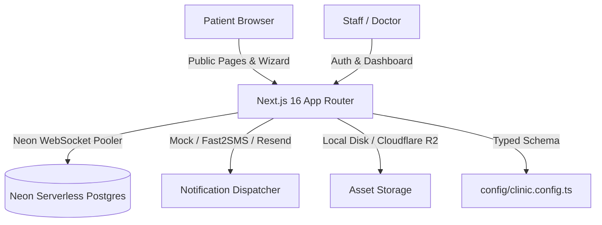

# Hyderabad Medical Clinic Consultation Booking Template

A production-quality, white-label consultation booking system and administrative portal engineered specifically for small medical clinics and polyclinics in Hyderabad, India. Built with Bun, Next.js 16 (App Router + Turbopack), Tailwind CSS v4, Prisma 7 with Neon serverless Postgres driver adapter, and Better Auth.

Each clinic receives an independent, single-tenant deployment: **one codebase, one Neon PostgreSQL database, one typed clinic configuration file, and zero hardcoded clinic details**.

---

## Table of Contents

1. [Architectural Overview](#architectural-overview)
2. [Tech Stack & Mandatory Conventions](#tech-stack--mandatory-conventions)
3. [Prerequisites](#prerequisites)
4. [Quickstart & Local Development](#quickstart--local-development)
5. [Database Setup & Neon Configuration](#database-setup--neon-configuration)
6. [Partial Unique Index & Double-Booking Prevention](#partial-unique-index--double-booking-prevention)
7. [Authentication & Staff Management](#authentication--staff-management)
8. [Onboarding a New Clinic in Under 30 Minutes](#onboarding-a-new-clinic-in-under-30-minutes)
9. [Notification System & Plug-and-Play Adapters](#notification-system--plug-and-play-adapters)
10. [Media Storage & Cloudflare R2 / AWS S3 Migration](#media-storage--cloudflare-r2--aws-s3-migration)
11. [Automated Testing](#automated-testing)
12. [Production Deployment](#production-deployment)
13. [Roadmap & Out-of-Scope Boundaries](#roadmap--out-of-scope-boundaries)

---

## Architectural Overview



### Core Features

- **Public Landing Page**: Clinic branding, doctors directory, consulting hours, address, Google Maps link, FAQ, and schema.org `MedicalClinic` structured data.
- **Doctor Consultation Booking Flow**:
  - Doctor selection filtered by specialty.
  - Interactive date and slot picker (categorized into Morning and Evening sessions).
  - Patient contact details with strict Indian mobile phone validation (`+91` E.164 format, starting with 6, 7, 8, or 9).
  - Unambiguous human-readable booking reference (`CLN-XXXXXX` using Crockford base32 alphabet omitting confusing chars `0, O, I, 1, L`).
  - RFC 5545 `.ics` calendar invitation download.
- **Patient Self-Service Portal (`/appointment/[reference]`)**:
  - Masked patient verification for privacy.
  - Appointment reschedule (within clinic lead-time policy).
  - Cancellation with audit logging.
- **Admin & Staff Dashboard (`/admin`)**:
  - Protected via Next.js 16 `proxy.ts` and Better Auth session cookies.
  - **Today's Queue (`/admin/today`)**: Real-time patient flow status (Booked, Checked In, Completed, No Show, Cancelled).
  - **All Appointments (`/admin/appointments`)**: Filter by doctor, status, date range, search by reference or phone.
  - **Manual Walk-in Booking (`/admin/appointments/new`)**: Direct walk-in patient creation.
  - **Doctors Manager (`/admin/doctors`)**: Add/edit doctors, bio, fees, room numbers, photo uploads.
  - **Schedules & Leave (`/admin/schedules`)**: Recurring weekly availability windows and doctor leave dates.
  - **Staff User Management (`/admin/staff`)**: Admin can invite staff with `admin` or `staff` roles.
  - **Audit Logging**: Every status transition, cancellation, or rescheduling is permanently logged.

---

## Tech Stack & Mandatory Conventions

- **Runtime & Package Manager**: [Bun](https://bun.sh/) (strictly use `bun install`, `bun run`, `bun test`, `bunx`).
- **Framework**: Next.js 16.3+ (App Router, Turbopack, React 19, Server Components & Server Actions).
- **Styling**: Tailwind CSS v4 with dynamic CSS variables injected from `clinicConfig.theme`.
- **Database**: [Neon](https://neon.tech/) Serverless PostgreSQL.
- **ORM**: Prisma 7 (`@prisma/client@7` with `@prisma/adapter-neon` via WebSocket pool mode).
- **Authentication**: [Better Auth](https://better-auth.com/) with Prisma adapter, Next.js cookie plugin, and Admin plugin. Public sign-up is disabled; staff accounts are created strictly by administrators.
- **Validation**: Zod (v4).
- **Date & Time Operations**: `date-fns` and `date-fns-tz` with clinic timezone locked to `Asia/Kolkata`.

---

## Prerequisites

1. **Bun**: v1.1 or later (`curl -fsSL https://bun.sh/install | bash`).
2. **Neon Account**: Free or Pro tier at [neon.tech](https://neon.tech).

---

## Quickstart & Local Development

1. **Clone and Install Dependencies**:
   ```bash
   git clone <repo-url> clinic-template
   cd clinic-template
   bun install
   ```

2. **Configure Environment Variables**:
   Copy `.env.example` to `.env`:
   ```bash
   cp .env.example .env
   ```

3. **Configure Neon Database URLs**:
   In `.env`:
   ```bash
   # Neon pooled connection string for runtime queries (WebSocket pooler)
   DATABASE_URL="postgresql://<user>:<password>@<neon-pooler-host>/neondb?sslmode=require"

   # Neon direct connection string for schema migrations and Prisma CLI
   DIRECT_URL="postgresql://<user>:<password>@<neon-direct-host>/neondb?sslmode=require"

   # Better Auth Secret (generate with: openssl rand -base64 32)
   BETTER_AUTH_SECRET="your-secure-random-secret-here-min-32-chars"
   BETTER_AUTH_URL="http://localhost:3000"

   # Initial Administrator Seed Credentials
   INITIAL_ADMIN_EMAIL="admin@apollo-demo.local"
   INITIAL_ADMIN_PASSWORD="Admin@Apollo2026!"
   INITIAL_ADMIN_NAME="Clinic Administrator"

   # Active Clinic Configuration (points to config/clinic.demo.ts)
   CLINIC_CONFIG="demo"
   NEXT_PUBLIC_SITE_URL="http://localhost:3000"
   ```

4. **Deploy Database Migrations & Seed**:
   ```bash
   # Apply migrations to Neon
   bun run db:migrate

   # Seed default doctors, schedules, holidays, and initial admin account
   bun run db:seed
   ```

5. **Start the Development Server**:
   ```bash
   bun run dev
   ```
   Open [http://localhost:3000](http://localhost:3000).

6. **Log in to Admin Dashboard**:
   - URL: [http://localhost:3000/admin/login](http://localhost:3000/admin/login)
   - Email: `admin@apollo-demo.local`
   - Password: `Admin@Apollo2026!`

---

## Database Setup & Neon Configuration

Prisma 7 introduces `prisma.config.ts` for database connections and migrations.

### `prisma.config.ts`
```ts
import "dotenv/config";
import { defineConfig } from "prisma/config";

export default defineConfig({
  schema: "prisma/schema.prisma",
  datasource: {
    // Migration CLI requires direct, unpooled connection
    url: process.env.DIRECT_URL || process.env.DATABASE_URL!,
  },
});
```

### Neon Adapter Singleton (`lib/db.ts`)
Runtime operations utilize `@prisma/adapter-neon` with `@neondatabase/serverless` over WebSockets:
```ts
import { PrismaClient } from "@prisma/client";
import { PrismaNeon } from "@prisma/adapter-neon";
import ws from "ws";

// Configured with WebSocket polyfill for serverless Node/Bun runtimes
const adapter = new PrismaNeon({
  connectionString: process.env.DATABASE_URL!,
  webSocketConstructor: ws,
});

export const prisma = new PrismaClient({ adapter });
```

---

## Partial Unique Index & Double-Booking Prevention

### The Race Condition Problem
In consultation booking systems, concurrent requests can pass slot availability validation at the application level and insert conflicting records.

### Database-Level Guarantee
We enforce concurrency safety at the PostgreSQL engine level using a **partial unique index**.
This allows a cancelled appointment slot to be re-booked immediately while strictly preventing two active appointments (`BOOKED` or `CONFIRMED`) for the same doctor at the same UTC timestamp:

```sql
CREATE UNIQUE INDEX appointments_doctor_slot_active_uniq
ON appointments (doctor_id, starts_at)
WHERE status IN ('BOOKED', 'CONFIRMED');
```

### How This Is Preserved in Migrations
1. The migration file `prisma/migrations/20260919163006_init/migration.sql` includes this statement explicitly.
2. If you generate additional migrations in the future:
   ```bash
   bunx prisma migrate dev --create-only
   ```
   Inspect the newly generated SQL file to ensure the partial unique index is not dropped. Then deploy with `bun run db:migrate`.
3. In `app/actions/booking.ts`, any concurrent booking attempt that hits this index throws Prisma error code `P2002` (Unique constraint failed), which is gracefully caught and returned to the patient as:
   *"This time slot was just booked by another patient. Please choose another slot."*

---

## Authentication & Staff Management

- Built on **Better Auth v1.7+** with Prisma adapter and `admin` plugin.
- **Public registration is disabled**: Visitors cannot sign up.
- **Admin Access**:
  - The initial admin is seeded via `bun run db:seed`.
  - Admins can add new clinic staff and doctors via `/admin/staff` using the `createStaffUser` server action.
  - Role-based permissions (`admin` vs `staff`). Admins can manage doctors, schedules, and staff accounts; staff can check in patients and manage appointments.
- **Next.js 16 Protection (`proxy.ts`)**:
  - Next.js 16 replaces `middleware.ts` with `proxy.ts`.
  - Unauthenticated requests targeting `/admin/*` (except `/admin/login`) are redirected to the login screen with a `from` search parameter.

---

## Onboarding a New Clinic in Under 30 Minutes

Each clinic deployment is completely self-contained. To provision a new client (e.g., "Care Poly Clinic, Banjara Hills"):

### Step 1: Create a Neon Database
1. Go to [console.neon.tech](https://console.neon.tech) and create a new project: `care-polyclinic-hyd`.
2. Copy the **Pooled Connection String** (for `DATABASE_URL`) and **Direct Connection String** (for `DIRECT_URL`).

### Step 2: Create the Clinic Configuration File
Create `config/clinics/care-polyclinic.ts` (or duplicate `config/clinic.demo.ts`):

```ts
import { ClinicConfig } from "../schema";

export const careClinicConfig: ClinicConfig = {
  name: "Care Poly Clinic",
  tagline: "Family Healthcare & Multispeciality Care",
  slug: "care-polyclinic",
  siteUrl: "https://carepolyclinic.in",
  logo: "/images/care-logo.svg",
  phone: "040 2345 6789",
  whatsapp: "+91 98765 43210",
  email: "care@carepolyclinic.in",
  address: {
    street: "Road No. 12, Banjara Hills",
    locality: "Banjara Hills",
    city: "Hyderabad",
    state: "Telangana",
    pincode: "500034",
    landmark: "Opposite City Centre Mall",
    googleMapsUrl: "https://maps.google.com/?q=Banjara+Hills+Hyderabad",
  },
  operatingHours: {
    weekdays: "08:30 AM - 08:30 PM",
    saturday: "08:30 AM - 07:00 PM",
    sunday: "09:00 AM - 01:00 PM",
  },
  bookingPolicy: {
    slotDurationMinutes: 15,
    bookingWindowDays: 14,
    minLeadTimeMinutes: 60,
    allowReschedulingHours: 2,
    allowCancellationHours: 2,
  },
  theme: {
    primary: "hsl(210 90% 45%)",
    primaryForeground: "hsl(0 0% 100%)",
    secondary: "hsl(180 75% 38%)",
    accent: "hsl(160 84% 39%)",
    background: "hsl(210 40% 98%)",
    card: "hsl(0 0% 100%)",
  },
  // ...testimonials, faqs, about text, etc.
};
```

### Step 3: Switch Active Config in `config/clinic.config.ts`
Set the export in `config/clinic.config.ts` to reference the new configuration:
```ts
import { careClinicConfig } from "./clinics/care-polyclinic";
export const clinicConfig = careClinicConfig;
```

### Step 4: Add Logo & Assets
Place the clinic's logo and doctor images in `public/images/`.

### Step 5: Migrate & Seed New Database
```bash
# In your .env, point DATABASE_URL and DIRECT_URL to the new Neon instance
bun run db:migrate
bun run db:seed
```

### Step 6: Deploy
Deploy to Vercel, Railway, or VPS. Your new clinic is live!

---

## Notification System & Plug-and-Play Adapters

Consultation reminders and booking confirmations are managed in `lib/notifications/index.ts`.

### Current Development Mode (`mock`)
Logs all SMS and emails to the server console with formatted payloads (no external SMS gateway required during development).

### Switching to Fast2SMS / Twilio / MSG91
To connect an Indian SMS gateway (e.g. Fast2SMS for DLT-approved transactional templates):
1. In `.env`, set:
   ```bash
   SMS_PROVIDER="fast2sms"
   FAST2SMS_API_KEY="your-api-key"
   ```
2. Replace `mockSmsSender` in `lib/notifications/index.ts` with your gateway call:
   ```ts
   async function sendFast2Sms(phone: string, message: string) {
     await fetch("https://www.fast2sms.com/dev/bulkV2", {
       method: "POST",
       headers: { authorization: process.env.FAST2SMS_API_KEY! },
       body: JSON.stringify({
         route: "v3",
         sender_id: "TXTIND",
         message,
         language: "english",
         flash: 0,
         numbers: phone.replace("+91", ""),
       }),
     });
   }
   ```

### Daily Appointment Reminder Cron
A Vercel-compatible cron route is implemented at `app/api/cron/reminders/route.ts`.
Call this daily at 07:00 AM IST (`0 1:30 * * *` UTC) using your cron provider with authorization header:
`Authorization: Bearer <CRON_SECRET>`

---

## Media Storage & Cloudflare R2 / AWS S3 Migration

Doctor photos and clinic images are handled via `lib/storage-server.ts`.

### Current Local Disk Adapter
Saves uploads to `public/uploads/` and serves them via static path `/uploads/<filename>`.

### Migrating to Cloudflare R2 / AWS S3
For multi-instance serverless deployments:
1. Install AWS S3 SDK: `bun add @aws-sdk/client-s3`
2. Update `saveUploadedFile` in `lib/storage-server.ts`:
   ```ts
   import { S3Client, PutObjectCommand } from "@aws-sdk/client-s3";

   const s3 = new S3Client({
     region: "auto",
     endpoint: `https://${process.env.R2_ACCOUNT_ID}.r2.cloudflarestorage.com`,
     credentials: {
       accessKeyId: process.env.R2_ACCESS_KEY_ID!,
       secretAccessKey: process.env.R2_SECRET_ACCESS_KEY!,
     },
   });

   export async function saveUploadedFile(file: File, folder = "doctors"): Promise<string> {
     const key = `${folder}/${Date.now()}-${file.name}`;
     const buffer = Buffer.from(await file.arrayBuffer());
     await s3.send(new PutObjectCommand({
       Bucket: process.env.R2_BUCKET_NAME!,
       Key: key,
       Body: buffer,
       ContentType: file.type,
     }));
     return `${process.env.R2_PUBLIC_URL}/${key}`;
   }
   ```

---

## Automated Testing

The template includes unit tests for slot calculations, business rules, holiday handling, leave overlaps, phone normalization, reference generation, and rate limiting.

Run the test suite with Bun's test runner:
```bash
bun test
```

### Test Coverage Highlights:
- **`tests/slots.test.ts`**:
  - Pure calculation in `Asia/Kolkata` -> UTC conversion.
  - Verification that clinic holidays eliminate all slots for that day.
  - Verification that doctor leave windows suppress overlapping slots.
  - Verification that `BOOKED` and `CONFIRMED` appointments remove slots, while `CANCELLED` slots remain bookable.
  - Verification that `minLeadTimeMinutes` correctly excludes immediate slots.
  - Verification of booking window boundaries (`bookingWindowDays`).
- **`tests/booking.test.ts`**:
  - `CLN-XXXXXX` reference uniqueness and Crockford base32 alphabet validation.
  - Indian mobile number validation (`+91`, 10 digits starting with 6-9).
  - PII masking (`+91 98**** **10`).
  - Rate limiting sliding window behavior.
  - RFC 5545 iCalendar (`.ics`) string output validation.

---

## Production Deployment

### Option A: Vercel (Recommended)
1. Push repository to GitHub/GitLab.
2. Import project into Vercel.
3. Configure Build Settings:
   - Framework Preset: **Next.js**
   - Install Command: `bun install`
   - Build Command: `bun run build`
4. Add Environment Variables from `.env` (`DATABASE_URL`, `DIRECT_URL`, `BETTER_AUTH_SECRET`, `BETTER_AUTH_URL`, `CLINIC_CONFIG`, `NEXT_PUBLIC_SITE_URL`).
5. Deploy.

### Option B: Docker / Node / Bun Server
Build and run the production image:
```bash
bun run build
bun run start
```

---

## Roadmap & Out-of-Scope Boundaries

### Strict Scope Enforced
This product is strictly a **consultation booking platform**. The following are intentionally excluded from this codebase to maintain zero HIPAA/DISHA liability, zero pharmacy licensure requirements, and maximum reusability:
- ❌ No payment gateway integrations (consultation fees are paid directly at clinic reception).
- ❌ No teleconsultation or video calls.
- ❌ No lab tests, diagnostic scans, or health packages.
- ❌ No electronic health records (EHR), prescriptions, or medical history storage.
- ❌ No pharmacy or medicine deliveries.
- ❌ No health insurance claims processing.

### Planned Enhancements
- WhatsApp Interactive Message buttons via Meta Cloud API.
- Multi-language landing page toggle (English / Telugu / Urdu) driven by config dictionaries.
- Doctor consultation queue display TV screen (`/admin/display` board for waiting room).

---

## License & Commercial Use

Proprietary template for commercial resale to medical clinics and healthcare practitioners.
Developed by the engineering team. All rights reserved.
